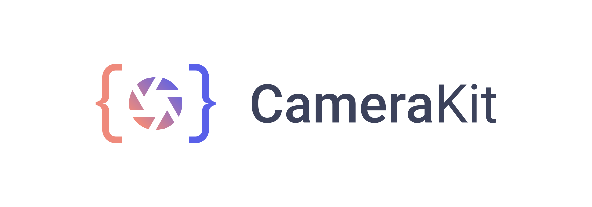

<p align="center">
    <a href="https://camerakit.io" target="_blank">
        
    </a>
</p>

<p align="center">
    <a href="https://spectrum.chat/camerakit/">
        
    </a>
    <a href="https://buddy.works/" target="_blank">
        
    </a>
</p>

CameraKit helps you add reliable camera to your app quickly. Our open source camera platform provides consistent capture results, service that scales, and endless camera possibilities.

With CameraKit Web you are able to effortlessly do the following:

- ✅ Create custom capture streams
- ✅ Capture image and video from the same stream
- ✅ Handle permissions automatically
- ✅ Set custom media sources
- ✅ Change stream resolution
- 📷 Capture images
- 📹 Record video
- 📹 Start, stop and pause video recording
- 🧲 Download images and videos

## Other Camera Implementations

CameraKit Web as the name suggests, is our camera platform for websites. In addition to Web, we provide our camera interface on the following platforms:

- [CameraKit Android](https://github.com/CameraKit/camerakit-android)
- [CameraKit iOS](https://github.com/CameraKit/camerakit-ios)

## Sponsored By

<a href="https://www.expensify.com/"></a>
<a href="https://www.buddy.works/"></a>

# Getting Started

## Setup

Install the `camerakit-web` package.

```
$ npm install camerakit-web
```

## Usage

Import and use `camerakit-web` in your project.

```js
import camerakit from "camerakit-web";
```

Or, alternatively, you can import via a script tag:

```html
<script src="path/to/camerakit.min.js"></script>
<!-- You can now access `camerakit` from the global scope -->
```

To properly support `webm` video recording and playback on Safari, you'll need to host the WebAssembly(wasm) and worker files packaged in `dist/browser/` on your webserver. The video recorder and player require these in order to function properly on Safari.

Example usage:

```js
async function () {
  const devices = await camerakit.getDevices();

  const myStream = await camerakit.createCaptureStream({
    audio: devices.audio[0],
    video: devices.video[0]
  });

  myStream.setResolution({width: 1920, height: 1080});
  const myPicture = myStream.shutter.capture();

  myStream.recorder.start();

  // Wait...

  // Pause the recording & resume
  await myRecorder.pause();
  await myRecorder.start();

  // Wait some more...

  const recordedVideo = await myRecorder.stop(); // Use the video yourself

  myRecorder.downloadLatestRecording(); // Download the video direct from browser

  // Stop using camera
  myStream.destroy();

  // Play video via camerakit player
  const player = new camerakit.Player();
  player.src = window.URL.createObjectURL(recordedVideo);

  // Use the video player wherever you want!
  document.getElementById("your-player-container").appendChild(player);
  player.play();
}
```

## Safari support details

**Safari audio recording not currently supported.**

If you'd like to host the wasm/worker files in a subdirectory, you'll need to update the `base` param on `camerakit.Loader` and as well as to `fallbackConfig` when calling `createCaptureStream`:

```js
import camerakit from "camerakit-web";

async function () {
  // Point fallback video player to correct directory
  camerakit.Loader.base = "/webm";

  const myStream = await camerakit.createCaptureStream({
    video: ...,
    audio: ...,
    fallbackConfig: {
      base: "/webm" // Point fallback recorder
    }
  });
}

```

## API documentation

### `camerakit`

#### Methods

| Name                            | Parameters                                                                             | Return                                                            | Description                                                     |
| ------------------------------- | -------------------------------------------------------------------------------------- | ----------------------------------------------------------------- | --------------------------------------------------------------- |
| `camerakit.getDevices`          | none                                                                                   | `Promise<{audio: Array<MediaSource>, video: Array<MediaSource>}>` | Returns available media devices for streaming                   |
| `camerakit.createCaptureStream` | `{audio?: MediaSource, video?: MediaSource, fallbackConfig?: Partial<FallbackConfig>}` | `Promise<CaptureStream>`                                          | Creates new `CaptureStream` instance with provided media inputs |
| `camerakit.enableStorage`       | `{method?: "localStorage" \| "sessionStorage" \| null}`                                | `void`                                                            | Enables photo storage as a default                              |
| `camerakit.disableStorage`      | none                                                                                   | `void`                                                            | Disables photo storage as a default                             |

#### Properties

| Name               | Type     |
| ------------------ | -------- |
| `camerakit.Player` | `Player` |
| `camerakit.Loader` | `Loader` |

### `CaptureStream`

#### Instance methods

| Name                    | Parameters                                                                             | Return                 | Description                                              |
| ----------------------- | -------------------------------------------------------------------------------------- | ---------------------- | -------------------------------------------------------- |
| `stream.init`           | none                                                                                   | `Promise<void>`        | Initializes stream and requests permissions from browser |
| `stream.setResolution`  | `{width?: number, height?: number, aspect?: number, source?: "original" \| "preview"}` | `Promise<void>`        | Sets the video resolution of the specified source        |
| `stream.setSource`      | `{audio?: MediaSource, video?: MediaSource, source?: "original" \| "preview"}`         | `Promise<void>`        | Overrides original media inputs for specified source     |
| `stream.getMediaStream` | `{source?: "original" \| "preview"}`                                                   | `Promise<MediaStream>` | Returns raw `MediaStream` for use in video display       |
| `stream.destroy`        | none                                                                                   | `void`                 | Closes all open streams and cancels capture              |

#### Properties

| Name              | Type       |
| ----------------- | ---------- |
| `stream.shutter`  | `Shutter`  |
| `stream.recorder` | `Recorder` |

### `Shutter`

Used for taking photos of the `CaptureStream`.

### Instance methods

| name                            | Parameters                                                                            | Return    | Description                                           |
| ------------------------------- | ------------------------------------------------------------------------------------- | --------- | ----------------------------------------------------- |
| `shutter.capture`               | `{source?: "original" \| "preview", save?: "localStorage" | "sessionStorage" | null}` | `string`  | Takes and returns picture from specified source       |
| `shutter.captureAndDownload`    | `{source?: "original" \| "preview", filename?: string}`                               | `boolean` | Calls `capture` and creates file download from result |
| `shutter.downloadLatestCapture` | `filename?: string`                                                                   | `boolean` | Downloads the last picture taken                      |

### `Recorder`

Used for recording video of the the `CaptureStream`.

### Instance methods

| name                               | Parameters                           | Return                    | Description                                                                                                            |
| ---------------------------------- | ------------------------------------ | ------------------------- | ---------------------------------------------------------------------------------------------------------------------- |
| `recorder.start`                   | `{source?: "original" \| "preview"}` | `Promise<void>`           | Starts the recording from the specified source                                                                         |
| `recorder.stop`                    | none                                 | `Promise<?[Blob, ?Blob]>` | Stops the recording and returns an array. First Blob is Video (and audio if available), the second is Audio on Safari. |
| `recorder.pause`                   | none                                 | `Promise<void>`           | Pauses the recording until resumed with `recorder.start()`                                                             |
| `recorder.getLatestRecording`      | none                                 | `?Blob`                   | Returns last recorded video file                                                                                       |
| `recorder.downloadLatestRecording` | `filename?: string`                  | `boolean`                 | Creates file download from last video recording                                                                        |
| `recorder.setMimeType`             | `mimeType: string`                   | `boolean`                 | Sets the video recording mime type for all sources                                                                     |

### `Player`

A player following the `HTMLVideoElement` spec. Reccomended for playback as it can serve as a fallback for browsers that don't natively support `webm`.

Example:

```js
const player = new camerakit.Player();

player.src = window.URL.createObjectURL(...);

player.play();
player.pause();
player.muted = true;
player.width = 1920;
player.height = 1080;
```

**NOTE:** If your browser supports the exported video, creating a `Player` instance will return a vanilla `HTMLVideoElement`.

### `Loader`

Exposed `OGVLoader`.

### `FallbackConfig`

**NOTE:** All fields are optional:

```js
{
  base: string; // Base directory for wasm/worker files

  width: number; // Video width
  height: number; // Video height
  bitrate: number; // Video bitrate
  framerate: number; // Video framerate
}
```

## License

CameraKit Web is [MIT License](https://github.com/CameraKit/camerakit-web/blob/master/LICENSE)
